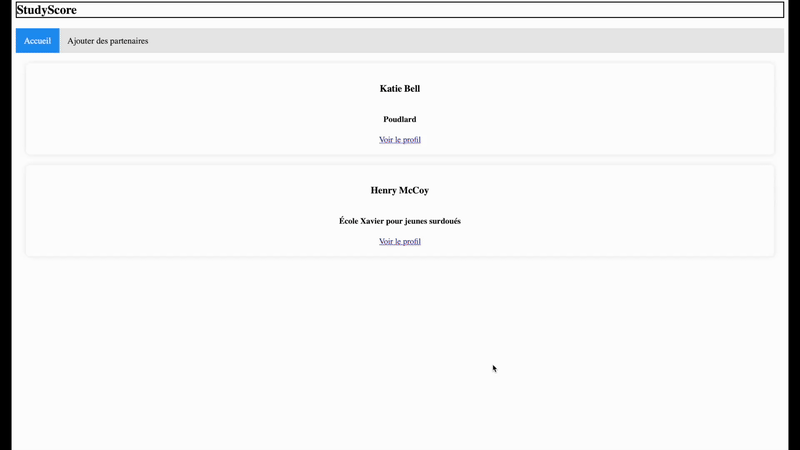

# StudyScore

<div align="center">
  
  [](#overview)
  [](#aperçu)

</div>


## Overview
StudyScore is an interactive web application that allows students to evaluate and share constructive feedback on their lab partners, offering a dynamic system for ratings and feedback. Designed for student communities worldwide, this platform makes it easy to add new partners for evaluation, fostering transparent and constructive academic collaboration.

<div align="center">
    <br><br>
</div>
This application uses a dynamic server built with Node.js and Express, along with an interactive front-end.

## Required Libraries

To install all the necessary dependencies, run the following command in both the site-web and server directories:
```bash
npm ci
```
This will install all libraries defined in the package.json file, using the exact versions specified in package-lock.json.

## Local Deployment

You can deploy a local static server using the `http-server` tool. If you run the `npm start` command in the `site-web` directory, a static HTTP server will be deployed on your machine and your site will be accessible at `localhost:3000` or `<your-IP-address>:3000`. The terminal output will give you the exact access address.

You can deploy a local dynamic server using Node.js. If you run the `npm start` command in the `server` directory, your server will be deployed on your machine and will be accessible at `localhost:5020` or `<your-IP-address>:5020`.

## Tests

For more information about the tests associated with this project, refer to the [TESTS.MD](./TESTS.MD) file.

---

<br><br><br>

---

## Aperçu
StudyScore est une application web interactive qui permet aux étudiants d’évaluer et de partager des commentaires constructifs sur leurs partenaires de laboratoires, offrant ainsi un système dynamique de notation et de rétroaction. Conçue pour les communautés étudiantes du monde entier, cette plateforme facilite l’ajout de nouveaux partenaires à évaluer, favorisant une collaboration académique transparente et constructive.

<div align="center">
    <br><br>
</div>
Cette application utilise un serveur dynamique construit avec Node.js et Express, ainsi qu’un front-end interactif.


## Librairies nécessaires

Pour installer toutes les dépendances nécessaires, exécutez la commande suivante dans les répertoires site-web et server :
```bash
npm ci
```
Ceci installera toutes les librairies définies dans le fichier `package.json` avec les versions exactes définies dans `package-lock.json`.

## Déploiement local

Vous pouvez faire un déploiement local de votre serveur statique avec l'outil `http-server`. Si vous lancez la commande `npm start` dans le répertoire `site-web`, un serveur HTTP statique sera déployé sur votre machine et votre site sera accessible sur l'adresse `localhost:3000` ou `<votre-adresse-IP>:3000`. La sortie dans le terminal vous donnera l'adresse exacte d'accès.

Vous pouvez faire un déploiement local de votre serveur dynamique utilisant Node.js. Si vous lancez la commande `npm start` dans le répertoire `server`, votre serveur sera déployé sur votre machine et sera accessible sur l'adresse `localhost:5020` ou `<votre-adresse-IP>:5020`.


## Tests

Pour en savoir plus sur les tests associés à ce projet, consultez le fichier  [TESTS.MD](./TESTS.MD).


